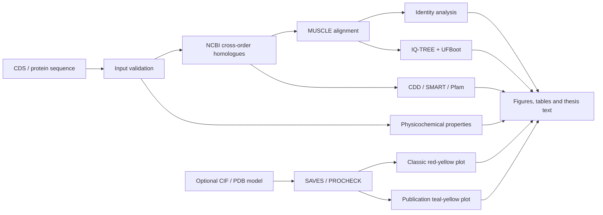

# Cross-order Protein Analysis

面向昆虫蛋白生物信息学分析与毕业论文制图的 Codex Skill。输入目标蛋白的核酸序列、氨基酸序列，以及可选的 CIF/PDB 三维结构后，可按照统一规范完成跨目同源序列筛选、多序列比对、序列一致性分析、最大似然系统发育树、保守结构域、理化性质和 Ramachandran 图分析，并生成可直接整理进毕业论文的中文材料与方法、结果分析和图注。

本 Skill 的绘图规范来源于蛋白 A、蛋白 B、蛋白 C 和蛋白 D 四组匿名测试案例的多轮优化，强调数据可追溯、图形紧凑、文字清晰和结论边界准确。匿名字母仅用于说明工作流程，不对应公开的具体蛋白、物种或研究项目。

## 主要功能

### 1. 输入序列检查

- 接受 CDS、氨基酸序列，或同时提供两者。
- 自动检查阅读框、内部终止密码子和末端终止密码子。
- 当 CDS 和氨基酸序列同时提供时，核对翻译结果是否一致。
- 默认使用完整、未剪切且未考虑翻译后修饰的蛋白序列。

### 2. 昆虫跨目同源序列分析

从以下五个昆虫目中分别筛选 2–3 条可靠同源序列，优先选择每目 3 个不同物种：

- 鳞翅目 Lepidoptera
- 鞘翅目 Coleoptera
- 双翅目 Diptera
- 膜翅目 Hymenoptera
- 半翅目 Hemiptera

候选序列根据 NCBI 登录号、查询覆盖度、E 值、氨基酸一致率、序列完整性、长度和结构域组成进行核对。BLAST 相似性仅用于筛选候选蛋白，不直接作为直系同源或功能一致的证据。

### 3. 多序列比对与一致性分析

- 使用 MUSCLE v5.3 进行完整氨基酸序列比对。
- 计算目标蛋白与每条参考序列的氨基酸一致率。
- 一致率仅在双方均为非缺口的可比较位点上计算。
- 完整比对以 2–3 个紧凑区块展示，不只截取局部保守区域。
- 某一氨基酸比例达到 70% 时标记为高度一致位点。
- 相同理化性质类别达到 70% 时标记为理化性质相似位点。

### 4. 最大似然系统发育树

- 根据位点占据率对比对结果进行修剪，默认保留至少 70% 序列具有残基的位点。
- 使用 IQ-TREE v3.1.3 和 ModelFinder/BIC 选择最适替换模型。
- 进行 1,000 次 ultrafast bootstrap（UFBoot）分析。
- 图中仅显示 UFBoot ≥70% 的节点。
- 采用紧凑矩形树，将目标蛋白放在第一行并用红色突出。
- UFBoot 数字使用 8 号字体、透明背景，并避开所有树枝和节点。

### 5. 保守结构域组成

- 综合 NCBI CDD、SMART 和 Pfam 结果确定结构域位置。
- 结构域轨道与系统发育树末端逐行对应。
- 必须显示目标蛋白的结构域轨道。
- 图例使用准确、易懂的生物学名称，不使用数据库代号替代结构域名称。
- 采用加宽、带轻微高光和阴影的 IBS 风格蛋白结构条。

### 6. 蛋白理化性质

提供 ExPASy ProtParam 兼容计算，输出：

- 氨基酸数目
- 分子量
- 理论等电点
- 酸性和碱性残基数目
- 分子式与原子总数
- 280 nm 摩尔消光系数
- 不稳定指数
- 脂肪族指数
- 平均疏水性 GRAVY
- 基于 N 端规则的预测半衰期

不稳定指数小于 40 时预测为稳定蛋白，大于 40 时预测为不稳定蛋白。结果同时保存为 TSV 三线表数据和 JSON 文件。

### 7. SAVES/PROCHECK 与双色 Ramachandran 图

当提供 ModelCIF、mmCIF 或 PDB 结构时，Skill 可进一步完成结构立体化学评价：

1. 将 AlphaFold/ModelCIF 转换为 SAVES 兼容的标准 PDB。
2. 提交 UCLA SAVES 并运行 PROCHECK。
3. 保存官方任务编号、原始图、summary 和详细报告。
4. 从结构坐标重新计算主链 φ/ψ 二面角。
5. 使用官方 PROCHECK 区域边界和百分比生成两套图。

两套图使用完全相同的残基坐标、区域计数和异常残基，仅改变视觉配色：

| 区域 | 经典版 | 期刊版 |
|---|---|---|
| 最有利区 | 红色 `#F50000` | 深青绿色 `#5FA8A0` |
| 额外允许区 | 黄色 `#FFF200` | 浅青绿色 `#B9DCD5` |
| 宽松允许区 | 浅黄色 `#FFF9A6` | 浅黄色 `#F4E6A2` |
| 禁阻区 | 白色 `#FFFFFF` | 近白色 `#FAFAFA` |

每套图均导出 600 dpi PNG、矢量 PDF 和可编辑 SVG，并输出残基级 φ/ψ 数据、官方比例、区域计数和禁阻区残基信息。

> PROCHECK 官方 summary、详细报告和原始图是统计结果的权威来源。本地绘图只负责重新计算坐标与可视化，不会将近似允许区冒充官方 PROCHECK 评分。

## 标准工作流程



## 图形输出规范

- 正文字体、序列名称、坐标轴和图例：Arial 10 pt。
- 面板标题：13 pt、加粗、左对齐。
- UFBoot：8 pt、透明背景。
- 目标蛋白：红色、加粗并放在第一行。
- 系统发育树：紧凑矩形布局，保留 substitutions/site 比例尺。
- 序列比对：全长展示并压缩为 2–3 个区块。
- 单图输出：A 系统发育树与结构域、B 序列一致性、C 全长多序列比对。
- 组合图输出：PDF、300 dpi PNG 和可编辑 SVG。
- Ramachandran 图：经典配色与期刊配色分别输出 PDF、600 dpi PNG 和 SVG。

## 论文文字输出

Skill 为每一种图或表分别生成简短的毕业论文文字：

- 跨目多序列比对与序列一致性
- 最大似然树与结构域组成
- 蛋白理化性质三线表
- PROCHECK 经典配色 Ramachandran 图
- 青绿期刊配色 Ramachandran 图

每部分均包含：

1. 材料与方法
2. 结果与分析
3. 图注或表注

正文只保留蛋白长度、一致率范围、最高一致率、关键 UFBoot、结构域位置与 E 值、主要理化参数和 PROCHECK 四类区域统计，避免堆砌次要数据。

## 安装

将仓库克隆到 Codex 的个人 Skill 目录：

```powershell
git clone https://github.com/hx-paper/hxx-cross-order-protein-analysis.git `
  "$env:USERPROFILE\.codex\skills\hxx-cross-order-protein-analysis"
```

如果目标文件夹已经存在，应先备份或更新现有版本，不要直接覆盖尚未保存的个人修改。

## 使用方式

在 Codex 中调用：

```text
使用 $hxx-cross-order-protein-analysis 分析下面这个蛋白。

蛋白名称：XXX
核酸序列：ATG...
氨基酸序列：M...
结构文件：C:\path\to\model.cif（可选）
结果保存到：C:\path\to\output
```

也可以使用自然语言触发，例如：

```text
请按照蛋白A、蛋白B、蛋白C和蛋白D匿名案例定稿的样式，分析这个昆虫蛋白，
完成跨目比对、进化树、结构域、理化性质和两种颜色的拉氏图，
并写出毕业论文的材料方法、结果和图注。
```

## 主要脚本

| 文件 | 用途 |
|---|---|
| `scripts/scaffold_protein_project.py` | 创建标准蛋白分析文件夹 |
| `scripts/calculate_physicochemical.py` | 计算理化性质并输出 TSV/JSON |
| `scripts/convert_modelcif_to_pdb.py` | 将 ModelCIF/mmCIF 转换为 SAVES 兼容 PDB |
| `scripts/render_ramachandran_dual_palette.py` | 生成两套 Ramachandran 图、CSV、JSON和论文文字 |

## 运行环境

推荐使用：

- Python 3.10 或更高版本
- NumPy
- SciPy
- Matplotlib
- Pillow
- Biopython
- MUSCLE v5.3
- IQ-TREE v3.1.3
- 可访问 NCBI、UCLA SAVES、CDD、SMART 和 Pfam 的网络环境

理化性质脚本依赖 Biopython；双色 Ramachandran 绘图脚本依赖 NumPy、SciPy、Matplotlib 和 Pillow。

## 科学解释边界

- BLAST 相似性不能单独证明直系同源关系或功能完全相同。
- 系统发育树属于蛋白家族基因树，不应直接替代昆虫物种树。
- UFBoot 较低的节点不用于确定性演化推断。
- 结构域、序列相似性和系统发育位置只能支持初步功能注释。
- Ramachandran 图反映模型主链构象的立体化学合理性，不能证明预测模型即为真实生物学构象。
- AlphaFold 低置信度区域与异常残基重叠时，只能说明局部解释需要谨慎，不能直接确定异常产生的原因。
- 具体底物、酶活、结合能力或调控功能仍需表达、酶学、结合或遗传学实验验证。

## 仓库结构

```text
.
├── SKILL.md
├── README.md
├── agents/
│   └── openai.yaml
├── references/
│   ├── final-style-spec.md
│   ├── output-contract.md
│   ├── ramachandran-workflow.md
│   └── thesis-text-spec.md
└── scripts/
    ├── scaffold_protein_project.py
    ├── calculate_physicochemical.py
    ├── convert_modelcif_to_pdb.py
    └── render_ramachandran_dual_palette.py
```

## Repository

GitHub: <https://github.com/hx-paper/hxx-cross-order-protein-analysis>
